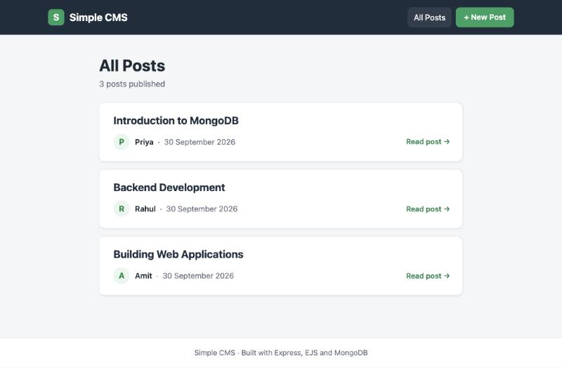
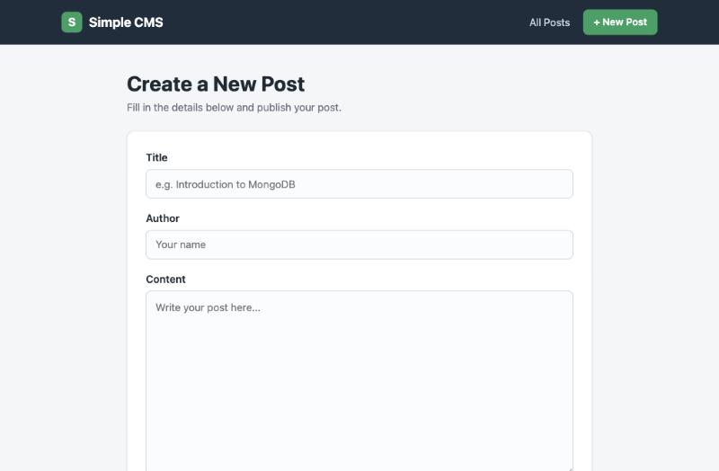
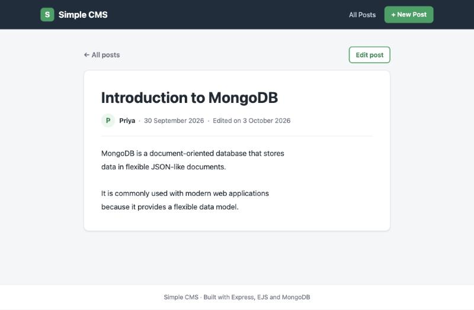
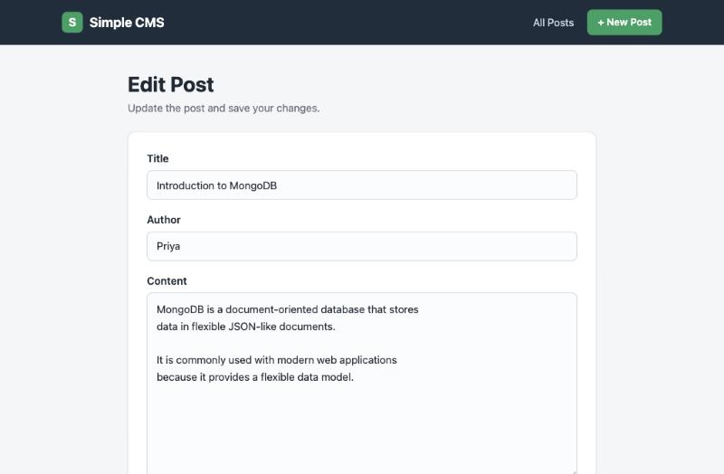
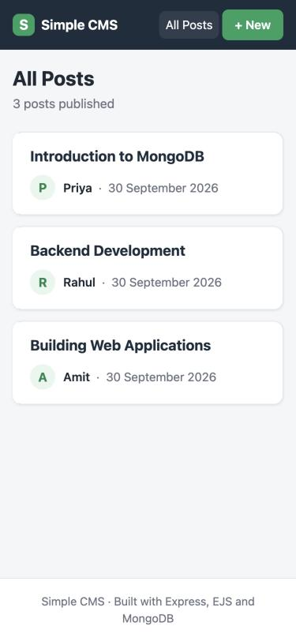

# Simple CMS — Mid Exam (Exam 01 C)

**Name:** Abhi Kumar Agrawal  
**SAP ID:** 590014564

A small blog CMS made with **Node.js, Express, EJS and MongoDB**. You can create a post, see all posts, click a title to read the full post, and edit a post.

## Features

- Home page lists all posts from MongoDB (newest first) with title, author and date
- Each title is a link to its own page, which loads the post from MongoDB by its `_id`
- The list page only fetches title, author and date — the full content is loaded only on the post page
- Form to create a post with title, content and author
- Title, content and author cannot be empty (checked on the server, the form keeps what you typed)
- `createdAt` is set by the server with `new Date()`, not entered in the form
- Every post has an **Edit** button that opens the form with its current values; saving updates it in MongoDB, keeps `createdAt` and adds an `updatedAt` date (shown as "Edited on ...")
- Posts are saved in MongoDB, so they stay after refreshing or restarting the server
- Wrong or missing post IDs show a "Post not found" page (also for editing)
- Responsive design: works on desktop, tablet and phones (down to 320px wide)

## Requirements

- Node.js
- MongoDB running on `mongodb://127.0.0.1:27017`

Database: `cms_lab` · Collection: `posts`

## How to run

```bash
cd app
npm install
npm start
```

Open http://localhost:3000

## Routes

| Method | Route | Purpose |
|--------|-------|---------|
| GET | `/` | Redirects to `/posts` |
| GET | `/posts` | Display all posts |
| GET | `/posts/new` | Display create-post form |
| POST | `/posts` | Create a new post |
| GET | `/posts/:id` | Display complete post |
| GET | `/posts/:id/edit` | Display edit form |
| POST | `/posts/:id/edit` | Save the edited post |

## Project structure

```
app/
├── app.js
├── package.json
├── views/
│   ├── partials/
│   │   ├── header.ejs
│   │   ├── footer.ejs
│   │   └── post-form.ejs  # form shared by create and edit
│   ├── posts.ejs        # list of posts
│   ├── new-post.ejs     # create-post form
│   ├── post.ejs         # single post
│   ├── edit-post.ejs    # edit form
│   └── not-found.ejs
├── public/
│   └── style.css
└── screenshots/
```

## Screenshots

**All posts**



**Create a post**



**Single post**



**Edit a post**



**On a phone**


